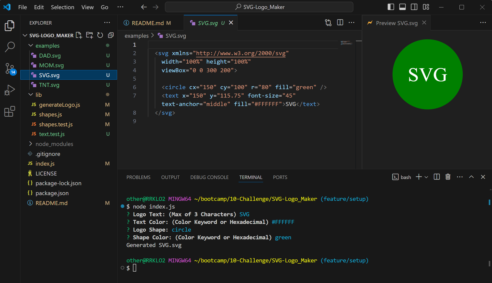
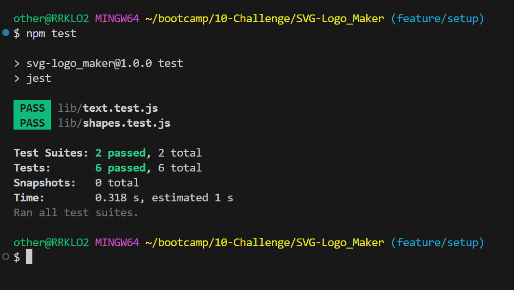

  # SVG-Logo_Maker
  [](./LICENSE)

  ## Description
  This is my week 10-Challenge. In this challenge I was to create a simple SVG logo generator from scratch. It will take in a few questions from the command line using "inquirer" then generate a svg file based on user input. I also needed to implement "jest" for testing the application.

  ## Table of Contents 
  * [Installation](#installation)
  * [Usage](#usage)
  * [License](#license)
  * [Contributing](#contributing)
  * [Tests](#tests)
  * [Questions](#questions)

  ## Installation
  To install necessary dependencies, run the following command:
  ```
  npm i
  ```
  ## Usage
  To start the app, run the following command:
  >`node index.js`
  >
  >You will then be prompted with a series of questions.
  >
  >***Logo Text:*** - takes a max of 3 characters and a min of 1\
  >***Text Color:*** - takes a Color Keyword or Hexadecimal - e.g. ( white or #FFFFFF )\
  >***Logo Shape:*** - select from list\
  >***Shape Color:*** - takes a Color Keyword or Hexadecimal - e.g. ( white or #FFFFFF )
  >
  >*** **[Video Link Demonstration](https://watch.screencastify.com/v/1Z983LE1x0dIhTCOJxSV)** ***

  Image examples of what to expect.
  \
  

  ## License
  This project is licensed under the **[MIT](./LICENSE)** license.

  ## Contributing
  N/A

  ## Tests
  To run tests, run the following command:
  ```    
  npm test
  ```
  ## Questions
  If you have any questions about the repo, open an issue or contact me directly at **rhinosstuff@gmail.com**.
  
  You can explore my other projects on GitHub **[rhinosstuff](https://github.com/rhinosstuff)**.
  
  